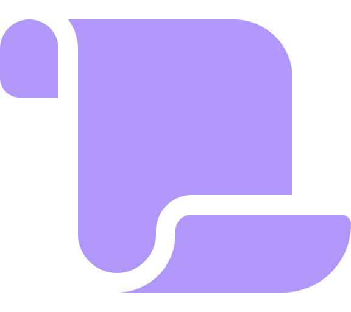
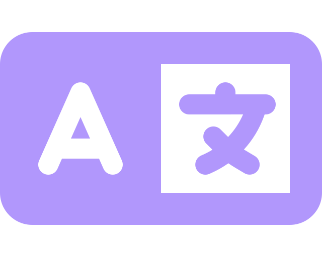
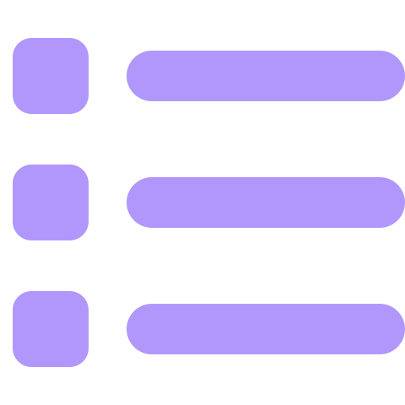
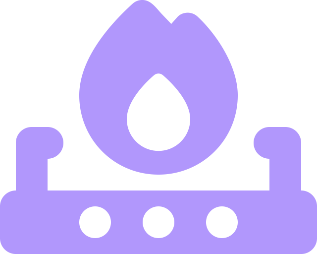
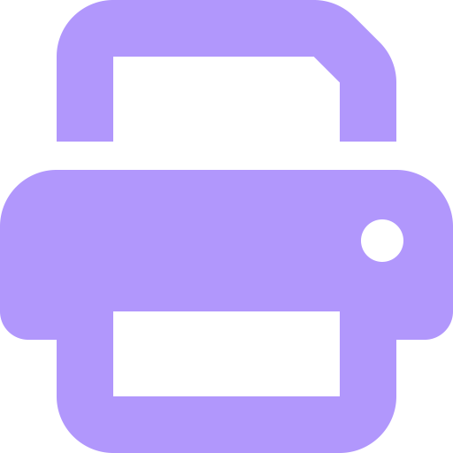
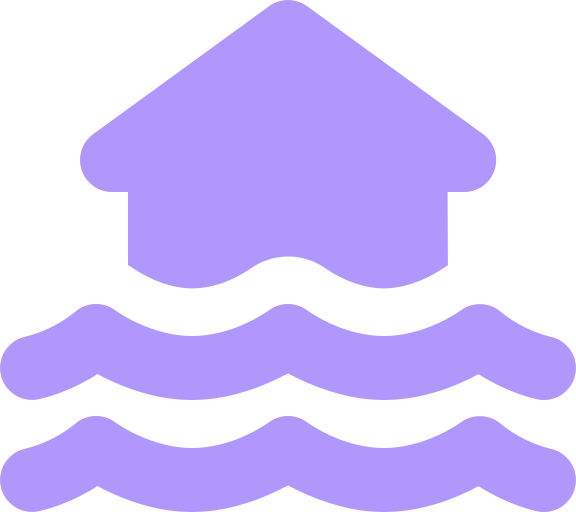
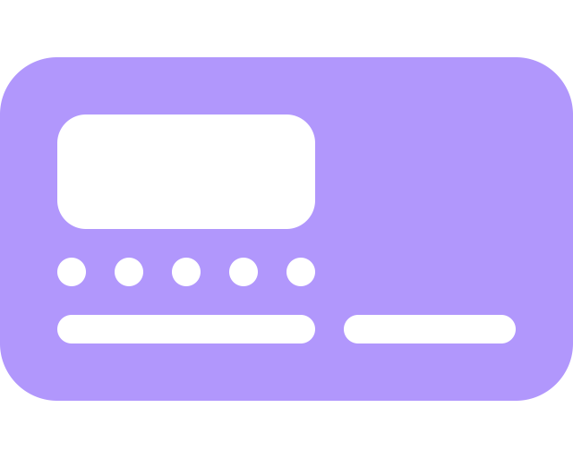
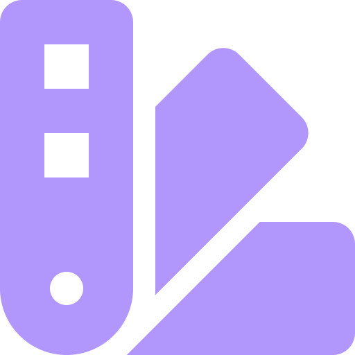
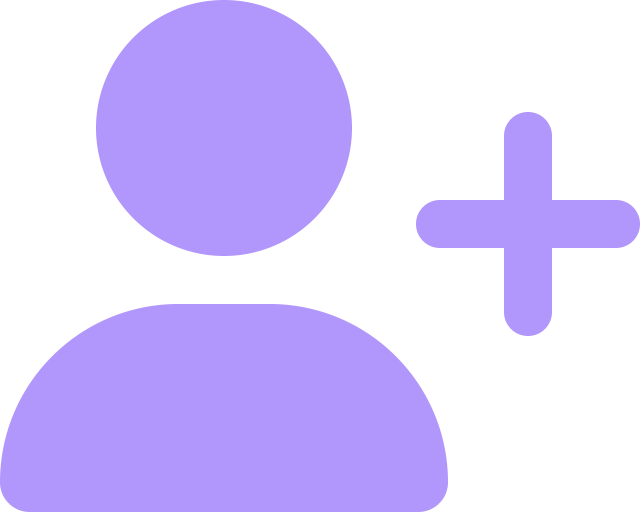
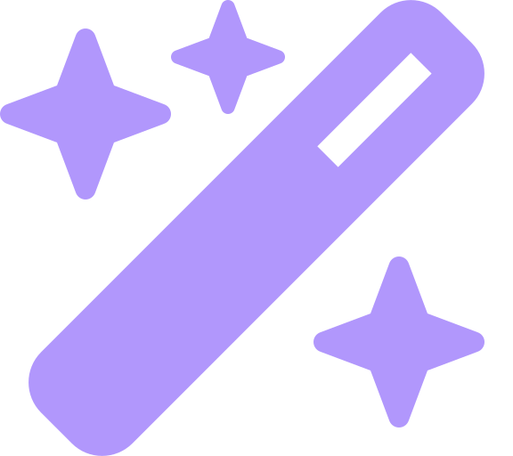

#  Bienvenue dans mon antre.
[See this in english ](./public/README-ENG.md)

---

##  Table des matières : 

- [À propos de moi](#img-srcpublicassetsiconsfire-burner-solidsvg-height18px-à-propos-de-moi-)
- [Mon dernier projet](#img-srcpublicassetsiconsprint-solidsvg-height18px-mon-dernier-projet-)
- [Mes outils et technologies](#img-srcpublicassetsiconstachograph-digital-solidsvg-height18px-mes-outils-et-technologies-)
- [Tous mes projets](#img-srcpublicassetsiconsreceipt-solidsvg-height18px-tous-mes-projets-)
- [Où me retrouver](#img-srcpublicassetsiconsuser-plus-solidsvg-height18px-où-me-retrouver-)

---

##  À propos de moi :

Bercé depuis ma plus tendre enfance par l'univers web, j'ai toujours aimé y prendre part ; que ce soit par l'univers des memes ou, maintenant, par le développement.
Précédemment graphiste et tatoueur, j'ai également un très grand attrait pour le front-end et l'intégration.
J'aime savoir que mes projets peuvent avoir une utilité, qu'ils touchent au divertissement ou aient une application dans la vie de tous les jours.

J'ai su piquer votre curiosité ? Alors n'hésitez pas à jeter un coup d'œil [à mes projets](#img-srcpublicassetsiconsreceipt-solidsvg-height18px-tous-mes-projets-) !

Et bon voyage sur mon github.

---

##  Mon dernier projet :

###  [Is my computer underwater ?](https://vaganuki.github.io/is-my-computer-under-water)

Dans ce projet, j'ai procuré au genre humain un nouvel outil d'une importance capitale.
C'est un testament de l'ingéniosité de l'Humain avec un grand H. C'est un témoignage de savoir pour les générations à venir.

>Ce n'est pas juste un site web. C'est un message, une balise d'espoir pour un avenir plus beau.

Technologie utilisée
: 

---

##  Mes outils et technologies :

|                                                                                                                                                                                                                                                     🌐 **Frontend**                                                                                                                                                                                                                                                      |                                                                                                                                                                                                           💾 **Backend**                                                                                                                                                                                                            |                                                                                                 🗄️ **Bases de données**                                                                                                 |                                                                                                                                                                                                                                                           🔧 **Outils**                                                                                                                                                                                                                                                           |
|:------------------------------------------------------------------------------------------------------------------------------------------------------------------------------------------------------------------------------------------------------------------------------------------------------------------------------------------------------------------------------------------------------------------------------------------------------------------------------------------------------------------------:|:-----------------------------------------------------------------------------------------------------------------------------------------------------------------------------------------------------------------------------------------------------------------------------------------------------------------------------------------------------------------------------------------------------------------------------------:|:------------------------------------------------------------------------------------------------------------------------------------------------------------------------------------------------------------------------:|:---------------------------------------------------------------------------------------------------------------------------------------------------------------------------------------------------------------------------------------------------------------------------------------------------------------------------------------------------------------------------------------------------------------------------------------------------------------------------------------------------------------------------------:|
|      |     |   |       |

---

##  Tous mes projets :

###  [Mon book !](https://vaganuki.github.io/book)

###  [Moi ou ton père ?](https://vaganuki.github.io/moiOuTonPere)

###  [Is my computer underwater?](https://vaganuki.github.io/is-my-computer-under-water)

---

##  Où me retrouver :

- [ Instagram](https://instagram.com/slxxpyboi)
- [ Instagram (l'autre)](https://instagram.com/slxxpyboi.tattoo)
- [ LinkedIn](https://www.linkedin.com/in/hugo-warnotte/)
- [ Moxfield](https://moxfield.com/users/Vaganuki)
- [ Mon Curriculum Vitae](https://www.canva.com/design/DAGQYVOALNI/uKaxy128L5twNBy3TQ9MRA/view?utm_content=DAGQYVOALNI&utm_campaign=designshare&utm_medium=link2&utm_source=uniquelinks&utlId=hc0ce673f13)
