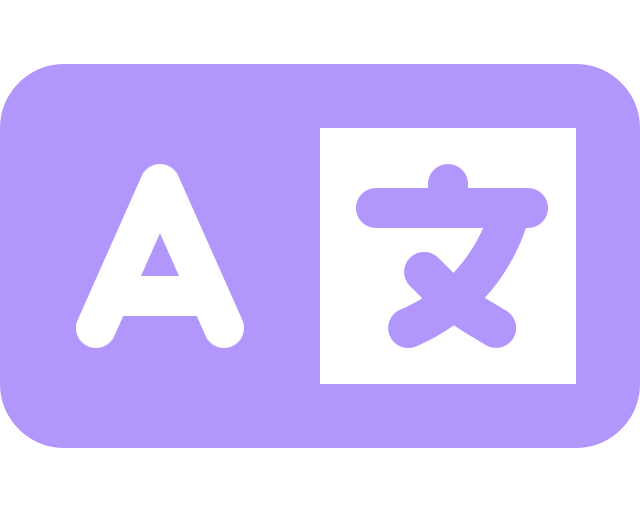
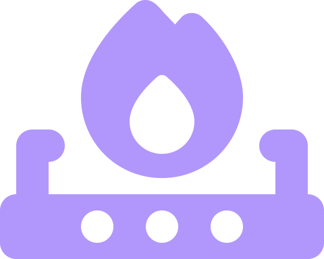

#  Welcome to my lair.
[Voir ce texte en français ](../README.md)

---

##  Summary :

- [About me](#-about-me-)
- [My last project](#-my-last-project-)
- [My tools & technologies](#-my-tools-&-technologies-)
- [All my projects](#-all-my-projects-)
- [Where to find me](#-where-to-find-me-)

---

##  About me :

Since as long as I can remember, I've always loved the world wide web; and taking part in it, by meming or now by developing website.
Former graphist and tattoo artist, I grew fond of front-end development and integration.
I love knowing that my projects have some form of utility, either being entertaining or by having a day-to-day use.

Did I get you intrigued ? Go take a look at [my projects](#) !

Have fun while you visit my github.

---

##  My last project :

###  [Is my computer underwater ?](https://vaganuki.github.io/is-my-computer-under-water)

With this project, I provided human kind a new tool of capital importance. It's a testament of Human ingenuity.
It is a testament of knowledge for generations to come.

>It isn't just a website. It's a message, a beacon of hope for a brighter future.

Technologies used
: 

---

##  My tools & technologies :

|                                                                                                                                                                                                                                                     🌐 **Frontend**                                                                                                                                                                                                                                                      |                                                                                                                                                                                                           💾 **Backend**                                                                                                                                                                                                            |                                                                                                     🗄️ **Database**                                                                                                     |                                                                                                                                                                                                                                                           🔧 **Tools**                                                                                                                                                                                                                                                           |
|:------------------------------------------------------------------------------------------------------------------------------------------------------------------------------------------------------------------------------------------------------------------------------------------------------------------------------------------------------------------------------------------------------------------------------------------------------------------------------------------------------------------------:|:-----------------------------------------------------------------------------------------------------------------------------------------------------------------------------------------------------------------------------------------------------------------------------------------------------------------------------------------------------------------------------------------------------------------------------------:|:------------------------------------------------------------------------------------------------------------------------------------------------------------------------------------------------------------------------:|:--------------------------------------------------------------------------------------------------------------------------------------------------------------------------------------------------------------------------------------------------------------------------------------------------------------------------------------------------------------------------------------------------------------------------------------------------------------------------------------------------------------------------------:|
|      |     |   |      |

---

##  All my projects :

###  [My book !](https://vaganuki.github.io/book)

###  [Me or your father ?](https://vaganuki.github.io/moiOuTonPere)

###  [Is my computer underwater?](https://vaganuki.github.io/is-my-computer-under-water)

---

##  Where to find me :

- [ Instagram](https://instagram.com/slxxpyboi)
- [ Instagram (the other one)](https://instagram.com/slxxpyboi.tattoo)
- [ LinkedIn](https://www.linkedin.com/in/hugo-warnotte/)
- [ Moxfield](https://moxfield.com/users/Vaganuki)
- [ My resume](https://www.canva.com/design/DAGQYVOALNI/uKaxy128L5twNBy3TQ9MRA/view?utm_content=DAGQYVOALNI&utm_campaign=designshare&utm_medium=link2&utm_source=uniquelinks&utlId=hc0ce673f13)
